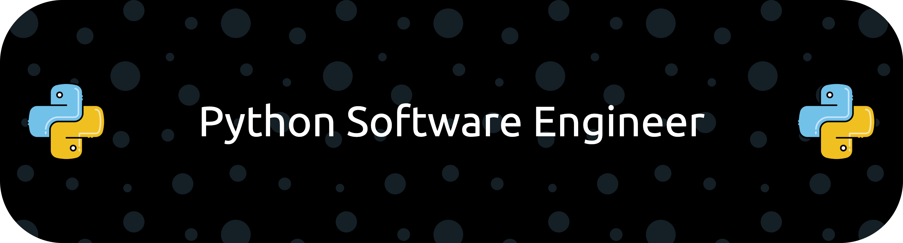

<h1 align="center">
    <a href="https://git.io/typing-svg"></a>
</h1>

<h3 align="center">I am a passionate Python Software Engineer from Ukraine</h3>

<br/>

<div align="center">
 
 🔭 I’m currently working as **a freelancer**
 
 🌱 I’m currently learning **ML, AI**

💬 Ask me about **Python, Databases... or anything [here](https://github.com/Vitalii-Khmura/Vitalii-Khmura/issues)**

```
⚡ my_hobbies_are = ["games", "sport activities"] ⚡
```

 </div>
 
<div align="center"> 
  <a href="mailto:vitalikkhmura13@gmail.com">
    
  </a>
</div>

 <hr/>
 
<h2 align="center">⚒️ Languages-Frameworks-Tools ⚒️</h2>
<br/>
<div align="center">
    
    
</div>

<br/>
<hr/>

<div align="center">
  <h2>🐍 My Contributions 🐍</h2>
  <br>
  
  
  <br/><br/><br/>
</div>
